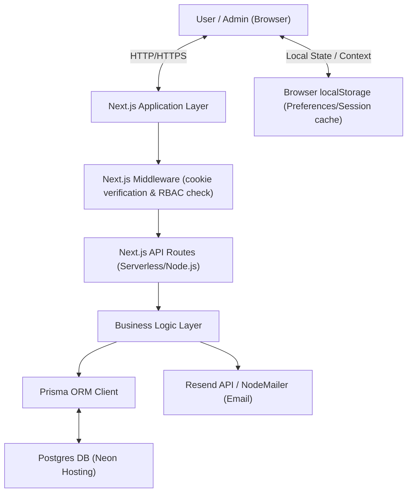
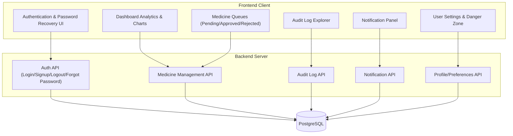
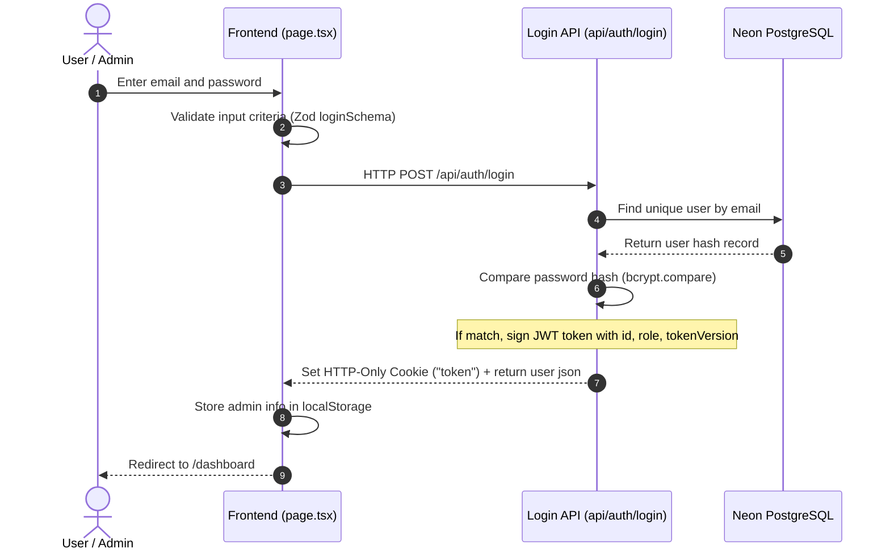
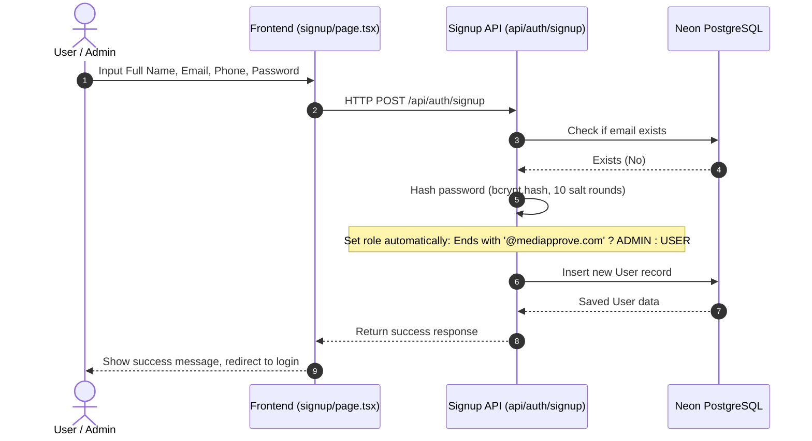
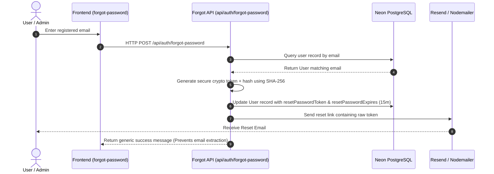
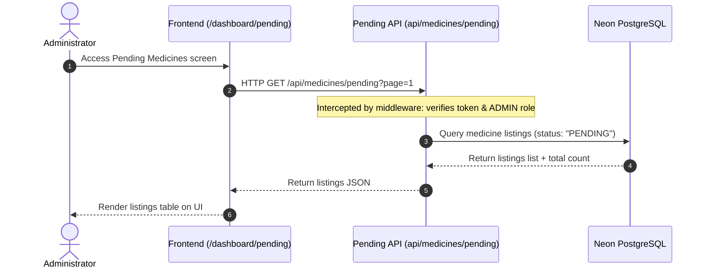
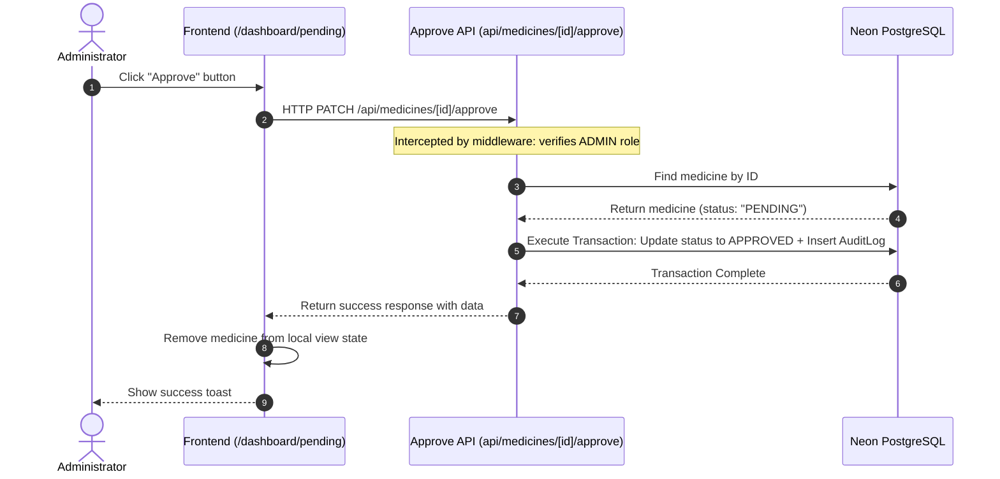
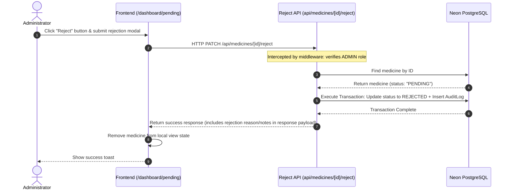

# High-Level Design (HLD) — MediApprove

This document outlines the High-Level Design (HLD) for **MediApprove**, an administrative portal and approval system for medicine listings.

---

## 1. System Overview

### Purpose
MediApprove provides a secure, auditable, and responsive platform for managing and verifying medicine listings. It acts as an intermediary step to ensure compliance, valid formulations, non-expired products, and correct vendor credentials before listings are officially approved.

### Problem Solved
Pharmaceutical platforms require rigorous verification to prevent illegal, expired, or counterfeit drugs from entering the supply chain. MediApprove automates compliance checks, structures the review queues for admins, and maintains a tamper-proof audit trail for regulatory adherence.

### Main Users
- **System Administrator (ADMIN):** Full access to pending, approved, and rejected medicine listings. Admins can perform actions (approvals, rejections), view system audit logs, manage notifications, and edit system preferences.
- **Compliance Officer/Standard User (USER):** Access to pending listings and dashboard metrics, but restricted from approving or rejecting listings.

### Main System Responsibilities
1. **Authentication & Session Management:** Secure signup/login using bcrypt password hashing, JWT credentials, and session cookie validation.
2. **Review Queues:** Separated workspaces for pending review, approved listings, and rejected listings.
3. **Approval/Rejection Workflows:** Core logic to approve/reject listings, backed by transaction-safe database states.
4. **Tamper-Evident Audit Logging:** Persistent logs tracking admin actions, IP addresses, OS/browsers, and remarks.
5. **Notification System:** Push notifications highlighting recent approvals, rejections, and security alerts.
6. **Password Recovery:** Safe forgot-password token flow using SHA-256 tokens and email alerts (Resend/SMTP/Ethereal).

---

## 2. System Architecture

MediApprove is built on the **Next.js App Router** framework using a monolithic architecture that bundles the frontend client, backend API routes, and database access layer in a single codebase.

### Architecture Diagram



### Supporting Services Overview
- **Next.js Middleware:** Intercepts incoming requests to protected API endpoints, parsing the JWT session cookie and verifying the payload before letting the request proceed.
- **Resend / Nodemailer:** Email dispatching engine. Supports the Resend REST API, SMTP connections, and an Ethereal-based mock SMTP for sandbox developer environments.
- **JWT (JSON Web Token):** Statelless authentication mechanism containing token versioning to allow instant revocation across all sessions.
- **Prisma Client:** Object-Relational Mapping (ORM) connecting Next.js serverless functions to PostgreSQL.

---

## 3. Module Architecture



### Module Responsibilities

| Module | Core Responsibility |
| :--- | :--- |
| **Authentication** | Handles user registration, credentials matching, session validation, logout, and token revocation. |
| **Role-Based Access Control (RBAC)** | Restricts API endpoints and pages based on user roles (`ADMIN` vs. `USER`). |
| **Dashboard Analytics** | Aggregates listing statistics (totals, pending, approved, rejected) and displays interactive charts. |
| **Medicine Queue Management** | Exposes review list controls, enabling sorting and filtering of database listings. |
| **Approval Workflow** | Validates listing constraints, marks a medicine as `APPROVED`, and writes to the audit log. |
| **Rejection Workflow** | Handles rejections, records justification remarks, and transitions listing status to `REJECTED`. |
| **Audit Logging** | Persists detailed records of admin actions, tracking author identity, target, type of action, and timestamp. |
| **Notifications** | Alerts administrators of queue events (new additions, decisions) and security events (password changes). |
| **Profile Management** | Allows users to view and update personal contact info and delete accounts permanently. |
| **Settings & Preferences** | Customizes time formats (12h/24h), dates, and handles global device logouts. |
| **Password Recovery** | Generates temporary SHA-256 password reset tokens and dispatches links via email. |

---

## 4. User Roles

MediApprove defines two system roles using a database enum `Role`:

### 1. Standard User (`USER`)
- **What they can access:** 
  - Login, Signup, Password Reset pages.
  - Dashboard home layout metrics.
  - Profile settings and general preferences (time format).
- **What they cannot access:**
  - Administrative routes: Approved, Rejected, Action Logs, and Pending medicine queues.
  - The middleware intercepts standard user tokens for protected endpoints and returns `403 Forbidden`.

### 2. Administrator (`ADMIN`)
- **What they can access:**
  - All standard user capabilities.
  - Pending reviews queue (where review actions are processed).
  - List of Approved medicines.
  - List of Rejected medicines.
  - Global action logs and audit histories.
  - Profile and settings cards (including account deletion).

### RBAC Enforcement Mechanism
1. **Frontend:** Conditional client rendering based on the user object stored in React Context and `localStorage`. Links and buttons like "Review", "Approve", or administrative pages are hidden for `USER` roles.
2. **Middleware Routing:** `middleware.ts` intercepts `/api/medicines/*`, `/api/dashboard/*`, and `/api/notifications/*`. If a decoded token does not have `role: "ADMIN"`, the request is terminated with a `403 Forbidden` JSON response.
3. **API Helpers:** In-route double checks via `getAuthenticatedAdmin(req)` which verifies role attributes directly from the database record.

---

## 5. Data Flow Diagrams

### A. Login Flow



### B. Signup Flow



### C. Forgot Password Flow



### D. View Pending Medicines Flow



### E. Approve Medicine Flow



### F. Reject Medicine Flow



---

## 6. Security Architecture

MediApprove implements defensive security patterns at multiple layers to protect application workflows:

```
[Client App] --> [HTTP-Only Cookie (JWT)] --> [Next.js Middleware] --> [API Route Enforcer (DB Sync)] --> [Neon PostgreSQL]
```

### Authentication vs. Authorization
- **Authentication:** Verifies *who* you are. Implemented using email credentials, bcrypt verification, and generating a signed JWT token on login.
- **Authorization:** Verifies *what* you can do. Implemented via Next.js middleware matchers and endpoint checks checking the `role` enum (`ADMIN` or `USER`).

### Security Features Checklist
- **Bcrypt Hashing:** User passwords are never saved in plain text. They are hashed using `bcrypt` with `10` salt rounds.
- **HTTP-Only Session Cookies:** JWT tokens are stored in cookies with `HttpOnly` and `SameSite: Lax` flags. This prevents Client-side script reading (mitigating XSS theft).
- **Endpoint Protection Middleware:** Block unauthenticated traffic at the edge for key routes before backend function initialization occurs.
- **Token Versioning:** Each user model has a `tokenVersion` field. When "Logout All Devices" is pressed, `tokenVersion` increments, making older JWTs instantly invalid.
- **Zod Validation:** Safe-parsing schemas validate payloads for Signup and Login routes, filtering malformed schemas.
- **SHA-256 Token Storage:** Password recovery tokens are hashed using SHA-256 before insertion. If the database leaks, recovery links cannot be extracted.

---

## 7. Database Architecture

The database architecture employs a structured relational schema hosted on a serverless PostgreSQL instance:

```
Frontend View (UI State) 
       ↓ (JSON API)
Next.js Serverless Routes
       ↓ (Prisma Client API)
Prisma ORM Generator
       ↓ (SQL Query over TCP/Pool connection)
Neon Serverless PostgreSQL DB
```

### Purpose of Prisma ORM
1. **Type Safety:** Auto-generates TypeScript models matching database schema layouts.
2. **Migrations Management:** Syncs schema updates safely to the Neon instance.
3. **Database Client Pool:** Manages serverless connection pooling to Neon.
4. **Declarative Transactions:** Simple syntax (`prisma.$transaction`) to chain dependent operations (like updating listings and creating audit logs) under a single database transaction.

---

## 8. Deployment Architecture

MediApprove is designed for deployment on modern cloud services:

```
                  [ GitHub Repository ]
                           │ (Push/Commit Trigger)
                           ▼
                  [ Vercel Hosting ]
                           │
       ┌───────────────────┴───────────────────┐
       ▼                                       ▼
[ Serverless API Functions ]            [ Static Frontend Assets ]
       │                                       │
       ├───────────────────────────────────────┤
       ▼                                       ▼
[ Neon Serverless PostgreSQL ]            [ Resend Email Engine ]
```

### Core Architecture Components
1. **GitHub:** Serves as the source control hub. Push triggers a webhook to start compilation.
2. **Vercel Platform:** Hosts the Next.js frontend pages and deploys the backend paths (`/api/*`) as lightweight serverless functions.
3. **Neon Serverless PostgreSQL:** Serves as the database. It scales compute resources dynamically according to API load.
4. **Resend Email Service:** Dispatches transaction-safe emails (like password reset requests) using an API key over HTTPS.

---

## 9. Non-Functional Design

### Security
- Stateless token validation combined with DB-level credential validation.
- Secure environment files to lock down database URLs, secrets, and API keys.

### Scalability
- Serverless backend components scale automatically to accommodate user spikes.
- Lightweight page weights and client assets cache on edge networks (CDNs).

### Maintainability
- Modular layout separating components (`/components`), configuration files, database logic (`/prisma`), and routing paths (`/app`).
- Comprehensive TypeScript declarations for type enforcement.

### Reliability & Data Integrity
- Prisma transaction managers enforce acid compliance for listing decisions.
- Foreign key constraints prevent orphaned entries (e.g., matching audit logs to active users).

### Performance
- Tailored database indexes on model foreign keys (`adminId`, `listingId`) to maintain fast query response times under high database volumes.
- Automatic compression of styles using Tailwind/PostCSS.

---

## 10. Design vs. Implementation Gaps

During analysis, several differences between the design goals and the actual codebase implementation were identified:

> [vanilla_css]
> **1. Rejection Endpoint Disconnection**
> While the API backend route `app/api/medicines/[id]/reject/route.ts` is fully implemented, the frontend React context function `rejectMedicine` in `components/ui/MedicineContext.tsx` only updates local mock variables in memory. It never makes an HTTP call to the reject endpoint. Real database items cannot be rejected through the UI.

> [vanilla_css]
> **2. Notification Model Mocking**
> The `Notification` model exists in `prisma/schema.prisma` and has related database fields. However, the API route `app/api/notifications/route.ts` queries the `AuditLog` table and returns audit logs as notifications. The database `Notification` table is completely unused.

> [vanilla_css]
> **3. UI Sidebar & Routing Conflicts**
> The frontend matches routes like `/dashboard/companies` in navigation bars and layouts, but the folder `app/dashboard/companies` is empty. Also, some settings components (like `SecuritySettingsCard`, `SystemStatusCard`) are present in the component library but are not imported or visible in the main settings page.

> [vanilla_css]
> **4. Middleware Matcher Limitations**
> The middleware enforcer blocks standard users (`USER`) from any route matching `/api/medicines/:path*`. Because `/api/medicines/pending` matches this pattern, regular users get blocked with a 403 error by the middleware, despite the route code being written to allow general authenticated access.
