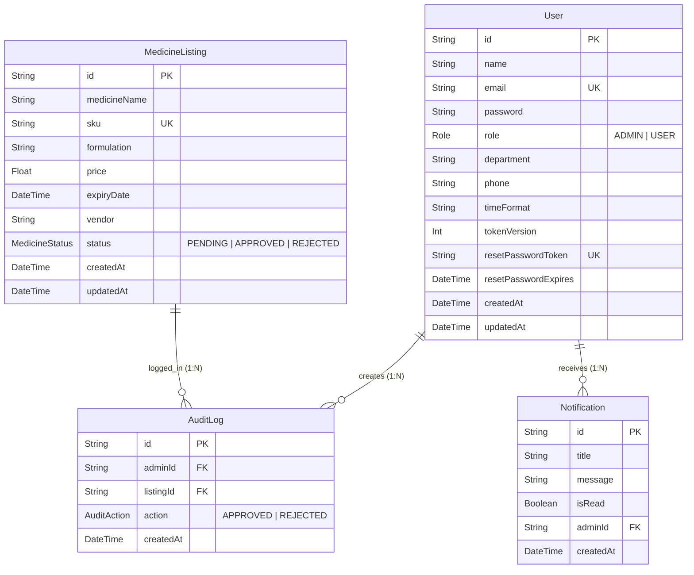

# Low-Level Design (LLD) — MediApprove

This document outlines the Low-Level Design (LLD) for **MediApprove**, detailing code files, database architectures, API paths, state logic, and specific security mechanisms implemented.

---

## 1. Project Structure

The project code is organized within the `mediapprove` directory:

```
mediapprove/
├── app/                        # Next.js App Router folders
│   ├── api/                    # Server-side API Route Handlers
│   │   ├── audit-logs/         # GET /api/audit-logs
│   │   ├── auth/               # Login, signup, logouts, password reset APIs
│   │   ├── dashboard/          # GET /api/dashboard statistics aggregator
│   │   ├── medicines/          # GET queue listings & PATCH approvals/rejections
│   │   ├── notifications/      # GET notification feeds (AuditLog-backed)
│   │   └── profile/            # Profile updates & account deletion endpoints
│   ├── dashboard/              # Frontend layout and page routes
│   │   ├── action-logs/        # /dashboard/action-logs admin UI
│   │   ├── approved/           # /dashboard/approved workspace UI
│   │   ├── pending/            # /dashboard/pending review workspace UI
│   │   ├── rejected/           # /dashboard/rejected review workspace UI
│   │   ├── profile/            # Profile configuration interface
│   │   └── settings/           # Custom preferences UI
│   ├── forgot-password/        # Password recovery email submission page
│   ├── reset-password/         # New credentials reset form
│   ├── signup/                 # Registration interface
│   └── page.tsx                # Base entry Login page
├── components/                 # Shared React Components
│   ├── notifications/          # Notification Cards, stats, lists, and drawers
│   ├── profile/                # Input forms, action buttons, and details views
│   ├── settings/               # Settings toggles, zones, and summary cards
│   └── ui/                     # Generic modals, buttons, and layout contexts
├── lib/                        # Shared Helper and System Utilities
│   ├── audit.ts                # DB helper to create audit logs
│   ├── auth.ts                 # Request session authentication functions
│   ├── email.ts                # SMTP/Resend API email dispatcher
│   ├── hash.ts                 # Bcrypt password utilities
│   ├── jwt.ts                  # JWT signing and decoding helpers
│   ├── prisma.ts               # Global Prisma Client instance initialization
│   └── validators.ts           # Zod schema validation sets
├── prisma/                     # Database migrations & schemas
│   ├── schema.prisma           # Prisma Datasource & Database Models
│   └── seed.ts                 # DB seeding script (Admins, Users, Listings)
├── middleware.ts               # Router middleware intercepting admin requests
├── next.config.ts              # Next.js bundler settings
└── package.json                # Dependency packages configuration
```

---

## 2. Database LLD

The database structure is managed through Prisma and runs on a PostgreSQL database hosted by Neon.

### Entity-Relationship (ER) Diagram



### Models Specification

#### 1. User
- **Table Map:** `"Admin"`
- **Fields:**
  - `id` (String, `@id`, `@default(cuid())`)
  - `name` (String)
  - `email` (String, `@unique`)
  - `password` (String)
  - `role` (`Role` Enum: `ADMIN`, `USER`, `@default(USER)`)
  - `department` (String, Optional)
  - `phone` (String, Optional)
  - `timeFormat` (String, `@default("12h")`)
  - `tokenVersion` (Int, `@default(0)`)
  - `resetPasswordToken` (String, Unique, Optional)
  - `resetPasswordExpires` (DateTime, Optional)
  - `createdAt` (DateTime, `@default(now())`)
  - `updatedAt` (DateTime, `@updatedAt`)

#### 2. MedicineListing
- **Fields:**
  - `id` (String, `@id`, `@default(cuid())`)
  - `medicineName` (String)
  - `sku` (String, `@unique`)
  - `formulation` (String)
  - `price` (Float)
  - `expiryDate` (DateTime)
  - `vendor` (String)
  - `status` (`MedicineStatus` Enum: `PENDING`, `APPROVED`, `REJECTED`, `@default(PENDING)`)
  - `createdAt` (DateTime, `@default(now())`)
  - `updatedAt` (DateTime, `@updatedAt`)

#### 3. AuditLog
- **Fields:**
  - `id` (String, `@id`, `@default(cuid())`)
  - `adminId` (String, foreignKey to `User.id`)
  - `listingId` (String, foreignKey to `MedicineListing.id`)
  - `action` (`AuditAction` Enum: `APPROVED`, `REJECTED`)
  - `createdAt` (DateTime, `@default(now())`)
- **Indexes:**
  - `@@index([adminId])`
  - `@@index([listingId])`

#### 4. Notification
- **Fields:**
  - `id` (String, `@id`, `@default(cuid())`)
  - `title` (String)
  - `message` (String)
  - `isRead` (Boolean, `@default(false)`)
  - `adminId` (String, foreignKey to `User.id`)
  - `createdAt` (DateTime, `@default(now())`)
- **Indexes:**
  - `@@index([adminId])`

---

## 3. API LLD

All API routes are structured under Next.js App Router directories (`/api/*`).

| Method | Endpoint | Purpose | Authentication | Authorization | Input | Output |
| :--- | :--- | :--- | :--- | :--- | :--- | :--- |
| **POST** | `/api/auth/signup` | Registers new system administrators or users. | None | Public | JSON body (name, email, phone, password) | JSON with user details. |
| **POST** | `/api/auth/login` | Validates credentials, sets session cookie. | None | Public | JSON body (email, password) | JSON user data + cookie set. |
| **POST** | `/api/auth/logout` | Clears local session cookie. | None | Public | None | JSON confirmation message. |
| **POST** | `/api/auth/logout-all` | Revokes all active user tokens. | Cookie JWT | User/Admin (Match ID) | None | JSON confirmation message. |
| **POST** | `/api/auth/forgot-password` | Initiates reset token & dispatches email link. | None | Public | JSON email body | Generic JSON confirmation. |
| **POST** | `/api/auth/reset-password` | Commits new password with token credentials. | None | Public | JSON token, password, confirmPassword | JSON confirmation message. |
| **GET** | `/api/medicines` | Retrieves list of pending review items. | Cookie JWT | ADMIN only | None | JSON list of medicines. |
| **GET** | `/api/medicines/pending` | Fetches listings (one at a time pagination). | Cookie JWT | All roles | Search query string (page) | JSON matching pagination metadata. |
| **GET** | `/api/medicines/[id]` | Retrieves detail layout for one listing. | Cookie JWT | All roles | Path variable `[id]` | JSON details layout. |
| **PATCH**| `/api/medicines/[id]/approve` | Approves listing status. | Cookie JWT | ADMIN only | Path variable `[id]` | Transaction data JSON. |
| **PATCH**| `/api/medicines/[id]/reject` | Rejects listing status. | Cookie JWT | ADMIN only | Body reason notes, Path `[id]` | Transaction data JSON. |
| **GET** | `/api/audit-logs` | Fetches global audit trail log. | Cookie JWT | ADMIN only | None | Audit list JSON. |
| **GET** | `/api/notifications` | Fetches notification events listing. | Cookie JWT | All roles | None | AuditLogs mapped as Notification JSON. |
| **GET** | `/api/profile` | Fetches user profile settings. | Cookie JWT | All roles | None | Current user JSON details. |
| **PUT** | `/api/profile` | Updates user settings or format preferences. | Cookie JWT | All roles | JSON body (name, email, phone, timeFormat) | Updated user settings JSON. |
| **DELETE**| `/api/profile` | Deletes user profile and cascades related tables. | Cookie JWT | All roles | JSON body (password confirmation) | Account deleted confirmation JSON. |

---

## 4. Authentication LLD

Authentication processes run asynchronously:

### Registration (Signup) Flow
```
User Input Form (Name, Email, Phone, Password) 
       ↓ (Validated by Zod schema)
Hash Password (using bcrypt.hash with 10 salt rounds)
       ↓
Assign Role:
  - If email ends with "@mediapprove.com", role = ADMIN
  - Else, role = USER
       ↓
Insert record into database (User model mapped to Admin table)
```

### Authentication (Login) Flow
```
User Login Form (Email, Password)
       ↓ (Zod loginSchema validation)
Find User by Email in DB
       ↓ (If not found -> return 401 "Invalid credentials")
Compare password with stored hash via bcrypt.compare
       ↓ (If mismatch -> return 401 "Invalid credentials")
Generate JWT Token payload:
  {
    id: user.id,
    email: user.email,
    role: user.role,
    tokenVersion: user.tokenVersion
  }
       ↓
Sign JWT with JWT_SECRET, expiration: 1 day
       ↓
Set Cookie "token" (httpOnly: true, secure: true (production), sameSite: "lax")
```

---

## 5. Role-Based Access Control (RBAC) LLD

RBAC restrictions block unauthorized entry in two places:

### 1. Next.js Routing Middleware (`middleware.ts`)
The middleware intercepts endpoints matching:
- `/api/medicines/:path*`
- `/api/dashboard/:path*`
- `/api/notifications/:path*`

**Access Logic:**
```
Check Request Cookie header for "token"
       ↓ (No token -> return 401 "Unauthorized")
Verify JWT token signature using verifyToken helper
       ↓ (Signature validation failure -> return 401 "Invalid or expired token")
Read Token payload parameters:
  - If decoded.role !== "ADMIN" -> return 403 "Admin access required"
  - Else -> NextResponse.next() (Let execution pass to route handlers)
```

### 2. Inner-route Access Check (`lib/auth.ts`)
Used inside individual routes where middleware might be bypassed or dynamic permissions are needed.
- `getAuthUser(req)` fetches token, matches `tokenVersion` with database value (for logout check), and returns the full `User` record if valid.
- `getAuthenticatedAdmin(req)` calls `getAuthUser(req)` and validates that `user.role === "ADMIN"`. Returns `null` if check fails.

---

## 6. Medicine Approval LLD

Approvals run inside database transactions to ensure audit logs are generated concurrently with state changes:

```
Receive Request PATCH /api/medicines/[id]/approve
       ↓ (getAuthenticatedAdmin verify ADMIN role)
Find MedicineListing matching `id` in DB
       ↓ (If not found -> return 404 "Medicine not found")
Validate status parameter:
  - If medicine.status !== "PENDING" -> return 409 "Only pending medicines can be approved"
       ↓
Initialize Prisma Transaction:
  1. Update MedicineListing matching `id`:
     status = "APPROVED"
  2. Create AuditLog entry:
     adminId = admin.id
     listingId = medicine.id
     action = "APPROVED"
       ↓
Commit Transaction to Database
       ↓
Return HTTP 200 containing updated listing and log records
```

---

## 7. Audit Log LLD

Admin actions write directly to the database. In the UI, the `ActionLog` details are enriched for presentation:

### Action Logging Model

| Database Field | Type | Source | Purpose |
| :--- | :--- | :--- | :--- |
| `id` | String | Auto-generated CUID | Unique identifier. |
| `adminId` | String | Token verification (`admin.id`) | Links log to the responsible admin. |
| `listingId` | String | Route parameter `[id]` | Links log to the targeted medicine. |
| `action` | Enum | `APPROVED` or `REJECTED` | Action type identifier. |
| `createdAt` | DateTime | System timestamp | Execution record time. |

### Enrichment (Frontend UI mapping)
The React client extends these entries dynamically using local context methods (`addActionLog`):
```typescript
{
  ipAddress: "192.168.1.10",
  browser: "Chrome",
  os: "Windows 11",
  device: "Chrome / Windows 11",
  remarks: `Medicine approved/rejected by ${adminName}`
}
```

---

## 8. Notification LLD

The notification logic has an implementation deviation:

```
React Notification Panel component
       ↓
Fetch notification records from GET /api/notifications
       ↓
Backend Route handler queries Prisma AuditLog model (findMany with Admin and Listing data)
       ↓
Return AuditLog rows mapped to the client Notification Interface:
  - title = Action (e.g. "Medicine Approved")
  - description = Action description
  - type = Audit action type
  - isRead = local state management fallback
```

---

## 9. Password Reset LLD

Password recovery processes do not expose plaintext keys in the database:

### Initiation (Forgot Password)
1. User submits email address via `/api/auth/forgot-password`.
2. Find user matching email. If not found, return generic success to avoid enumeration leaks.
3. Generate high-entropy hex string: `crypto.randomBytes(32).toString("hex")`.
4. Hash this string with SHA-256 for database storage. Set expiry time to `15 minutes`.
5. Update user model: `resetPasswordToken = hashedToken`, `resetPasswordExpires = expires`.
6. Dispatch link to user email with the *unhashed* token: `/reset-password?token=${rawToken}`.

### Completion (Reset Password)
1. User visits recovery page, inputs raw token, and sets a new password.
2. Raw token is hashed with SHA-256.
3. Query user by `resetPasswordToken` (hashed token comparison).
4. If not found or expired, return `400 Invalid link`.
5. Hash new password with `bcrypt`.
6. Update user model: `password = newHash`, `resetPasswordToken = null`, `resetPasswordExpires = null`.

---

## 10. Frontend Component Architecture

Frontend components are organized using React Context (`MedicineContext.tsx`) for state sharing:

```
            [ MedicineProvider ]
                     │
     ┌───────────────┼───────────────┐
     ▼               ▼               ▼
[ Dashboard ]    [ Queues ]    [ Settings ]
     │               │               │
     └───────────────┼───────────────┘
                     ▼
           [ useMedicines Context ]
```

### Context State Management
- `medicines`: State list initialized from local mock databases (`mockMedicines.ts` and `mockApprovedMedicines.ts`). Updated dynamically on the client during review events.
- `approveMedicine(id, adminName)`: Handles UI status changes. If the target is a database entry, it invokes the backend PATCH `/api/medicines/${id}/approve`.
- `rejectMedicine(id, adminName, reason, notes)`: Updates client mock arrays locally.
- `timeFormat` and `dateFormat`: Global format flags persisted to `localStorage` and synchronized with the database `/api/profile` profile settings.

---

## 11. Error Handling

Errors are captured at runtime and converted to standard JSON schemas:

### REST API Errors
- **Validation Errors:** Zod errors are caught inside try/catch blocks and returned as `400 Bad Request` with error details:
  ```json
  { "success": false, "message": "Invalid input" }
  ```
- **Unauthorized Actions:** Middleware rejects requests returning `401 Unauthorized` or `403 Admin access required`.
- **Database Mismatch Errors:** Handled in route scopes using try/catch blocks, returning a `500 Internal Server Error` instead of raw database stack traces.

---

## 12. Validation

Validation is implemented across both frontend and backend layers:

### Zod Validation Schemas (`lib/validators.ts` & inline API schemas)
- `loginSchema`: Validates login payloads. Email format check and password minimum length `6`.
- `signupSchema`: Validates registration payloads. Email check, password minimum length `8`, and phone structure constraints: `/^\+?[0-9\s\-()]{7,20}$/`.
- `profileUpdateSchema`: Validates name length and formatting parameters before database profile mutations.

---

## 13. Security LLD

Key configurations for security modules:

- **Bcrypt:** Hashing uses `10` salt rounds, protecting user credentials from brute-force offline cracking in case of database leakage.
- **JWT:** Stateless payloads containing `id`, `email`, `role`, and `tokenVersion` signed with a secret key.
- **Cookie Security:** Cookies are set using `httpOnly: true`, preventing access from client scripts to mitigate Cross-Site Scripting (XSS).
- **Token Version Check:** Every user lookup checks `user.tokenVersion === token.tokenVersion`. If logout-all is triggered, database version increments, immediately invalidating old tokens across all devices.
- **SHA-256 Hashing:** Used for password reset tokens, ensuring leaked tokens cannot be utilized to hijack account sessions.
